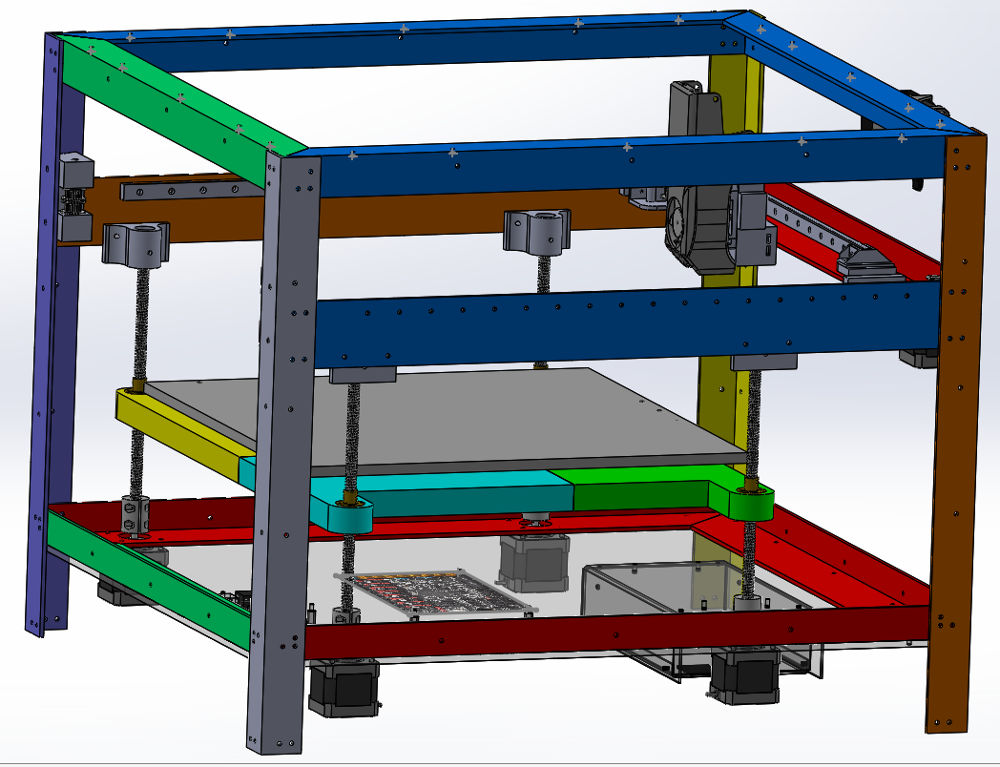

# My100 - A version of the100 with a metal frame that is designed to be built using a CNC or mitre saw and a drill press.

  
## &nbsp;&nbsp;&nbsp; As I do not have a 3D printer (Yet) but I do have a CNC that I built in 2007 using just a mitre saw and a drill press; The **My100** is a meant to be built using common metal materials for a frame instead of the more expensive 20/20 extruded aluminum of the Voron or 3D printed frame of the100. This project is based primarily upon the great work of <A HREF="https://github.com/MSzturc/the100">the100</A>
## &nbsp;&nbsp;&nbsp; BEWARE THIS WORK IS IN PROGRESS !! You can see what I have created so far and are more than welcome to contribute.
## &nbsp;&nbsp;&nbsp; At this time I have spent many many months studying the100 construction and others like the Voron as well. There are things I like about each. Using SolidWorks (Maker Edition) I have created a new fully defined 3D Printer assembly that encorporates what I believe to be the best features.
## &nbsp;&nbsp;&nbsp; I do have some vested interest in completing the project. To date I have purchased all the parts except the hotend. I must admit though that the build is a very slow process.
## &nbsp;&nbsp;&nbsp; Will the My100 be faster than the100, We shall see.

  
## Table of Contents
* [**My100 3D Printer Build Advantages**](#my100-3d-printer-build-advantages)
* [**Design Strategy**](#design-strategy)
* [***Imperial/Metric and Metal Thickness***](#imperialmetric-and-metal-thickness)
* [**SolidWorks 2023 Maker Edition and Equations**](#solidworks-2023-maker-edition-and-equations)
* [**Current Build Status My100 1.0 Alpha 1**](#current-build-status-my100-10-alpha-1)
* [**Precision Building With Mitre Saw and a Drill Press**](docs/PrecisionBuildingWithMitreSawAndADrillPress.md)
* [**Bill of Materials**](docs/My100BOM.html)
* [**Contributing**](#contributing)

  
## My100 3D Printer Build Advantages
&nbsp;&nbsp;&nbsp; Here are some of what I believe to be My100 improvements.
<UL>
<LI>Use cheaper 6061 "L" shaped aluminum for the frame.
<LI>Linear rails for the X&Y axis for faster operation (Possibly).
<LI>Four steppers for Z Axis for self leveling as in the Voron.
<LI>Wider 350 X 350mm build plate.
<LI>Keep threaded rod for Z-Axis so bed remains at height when powered off and is a less complicated assembly than gears/belts and pulleys.
<LI>Use 5mm steel shaft instead of M5 screws to support gantry bearings, eliminating noise and possible wear.
<LI>Use 20T pulley instead of F695 bearings. These seem to be higher quality. They run smoother around the 5mm steel shaft than a M5 machine screw.
<LI>Fastening holes are offsets of 2.5 and 3.5 of the aluminum thickness for precise drilling when using a drill press.
<LI>All parts to be created are fully defined in SolidWorks and have been designed with equations.
<LI>Fastening holes for an enclosure is mandatory feature. Any fumes from a 3D printer should be externally vented as they are extremely harmful.
<LI>Build plate is 350 X 350mm. The height is at 200mm as I prove in the design, but is easily changed via equations of VSLength. I decided to increase the width and length now because they affect buying a lot of larger internal components like the build plate, linear rails...
<LI>I also like the clicky and have purchased one, hopefully to incorporate it into the build later. For now it's more important to get the basics running.
</UL>
  

## Design Strategy
&nbsp;&nbsp;&nbsp; the100 is a great 3D printer otherwise I would not want to attempt to create one in the first place. It is also open source, as is the Voron. An inexpensive but precise metal frame is the first goal. 

&nbsp;&nbsp;&nbsp;20/20 extruded aluminum is expensive. Using more common 6061 "L" shaped aluminum is 50% cheaper. Just printing the100 with a 265x265mm bed was going to cost as of Oct 6/2023 $823 Cdn + tax. The aluminum for the frame of the My100 was $172 Cdn, including tax, plus $362 including tax for the Gantry blocks, larger 350 X 350mm bed, rod stabilizers and belt tensioners. Overall a much cheaper option with strength benefits. Further cost savings could be obtained if you created the bed out of metal too, but I splurged on a colorful bed. 

&nbsp;&nbsp;&nbsp;To maintain precision, with just a mitre saw and a drill press, there are certain tricks that can be used that are discussed below. Otherwise i olan to use my CNC.

### Imperial/Metric and Metal Thickness
&nbsp;&nbsp;&nbsp;Important: In Canada metal is still purchased in Imperial units. While lengths can be obtained in Metric, the thickness would still be 1/8th inches (.125in). The .125in thickness is used throughout the design, but otherwise Metric is used.
 

  
## SolidWorks 2023 Maker Edition and Equations
&nbsp;&nbsp;&nbsp; SolidWorks Maker Edition is a fantastic tool and at $10 month its well worth it. You can stop the license at any time to save you money. I found it prettyy easy to use and there are so many tutorials out there.

### Globals WorkAround
&nbsp;&nbsp;&nbsp;There is one issue I have with the SolidWorks Maker edition and that is it does not include support for global variables being read in from a file for multiple parts. This is extremely annoying as many parts share the same equations when calculating the position of corresponding holes.

&nbsp;&nbsp;&nbsp;To that end I created a Node.js tool called <A HREF="https://github.com/ztalbot2000/SWECompare">SWECompare (SolidWoreks Equation Comparison)</A> to help with the task of having multiple parts use the same equations. 
 

### Understanding the Equations
&nbsp;&nbsp;&nbsp;To change the dimensions of this 3D printer or to know how it was designed, you must understand the underlying equations.

#### Vertical alignment
&nbsp;&nbsp;&nbsp;Each component is stacked relative to the other, in the following manner.

<UL>
<LI>Electronics below the lower rail.
<LI>The length of the Z-Axis threaded rods at the end of the steppers.
<LI>The bed at the top of the Z-Axis.
<LI>The build plate on top of the bed.
<LI>The tip of the hotend on the build plate.
<LI>The top of the X-Axis linear guide block.
<LI>The bottom post of the gantry block equal to the end of the X&Y Axis stepper shaft.
<LI>The fastening point of the Y-Axis linear rail.
<LI>The placement of the belt holes to the hot end carrier aligning with the bottom post of the gantry block.
<LI>The placement of the belt tighteners to align with the bottom post of the gantry block.
<LI>The height of the hot end to the top of the frame.
</UL>

#### Left to Right Alignment.
&nbsp;&nbsp;&nbsp;It is not the build plate that dictates the width but the length of the X-Axis linear rail so it fits between the left and right gantry blocks. The bed and build plate are then centered between the steppers in this direction.

#### Front to Back Alignment
&nbsp;&nbsp;&nbsp;The front steppers for the Z-Axis are offset from the 45° cut. The build plate size dictates everything else. Similiarly the Y-Axis linear rail placement traverses the length of the build plate so that the hot end tip can reach the whole area.

## Current Build Status My100 1.0 Alpha 1
&nbsp;&nbsp;&nbsp; The main SolidWorks design is complete. The electronics will be added later. Fastening holes for an enclosure are added by default. As the design has only been proven in SolidWorks, I had printed the Gantry blocks, Belt fasteners hotend and even the bed. putting them together i noticed that there was no way to push out the pins in the Gantry Block or Belt fastener and having a shelf to hat mated the bed center was not optimal for printing. These issues are fixed in the design, so I'll label this as 1.0Alpha 1. 
&nbsp;&nbsp;&nbsp; The aluminum has been pre-cut to near exact lengths. I may use my CNC for exactness or my mitre saw following the rules of cutting all the same lengths of pieces at the same time using stop blocks.

  
## Contributing
&nbsp;&nbsp;&nbsp; Best ways to contribute
* Star it on [GitHub](https://github.com/ztalbot2000/My100) - if you use it and like it please at least star it :)
* Follow the repo on [GitHub](https://github.com/ztalbot2000/My100)
* Follow me [ztalbot2000](https://github.com/ztalbot2000)

  
## Inspiration and special thanks
Based on :
* [the100]https://github.com/MSzturc/the100
* Thanks especially to those who continue to work on the100 and those who make it better.
* And most importantly my Wife.

  
## License
See [LICENSE](LICENSE)

<!---
Link References (Not Local)
-->

[ncviewer]:https://ncviewer.com
[viewstl]:https://viewstl.com/classic/
[MeshCAM]:https://www.grzsoftware.com
[ztalbot2000]:https://github.com/ztalbot2000
