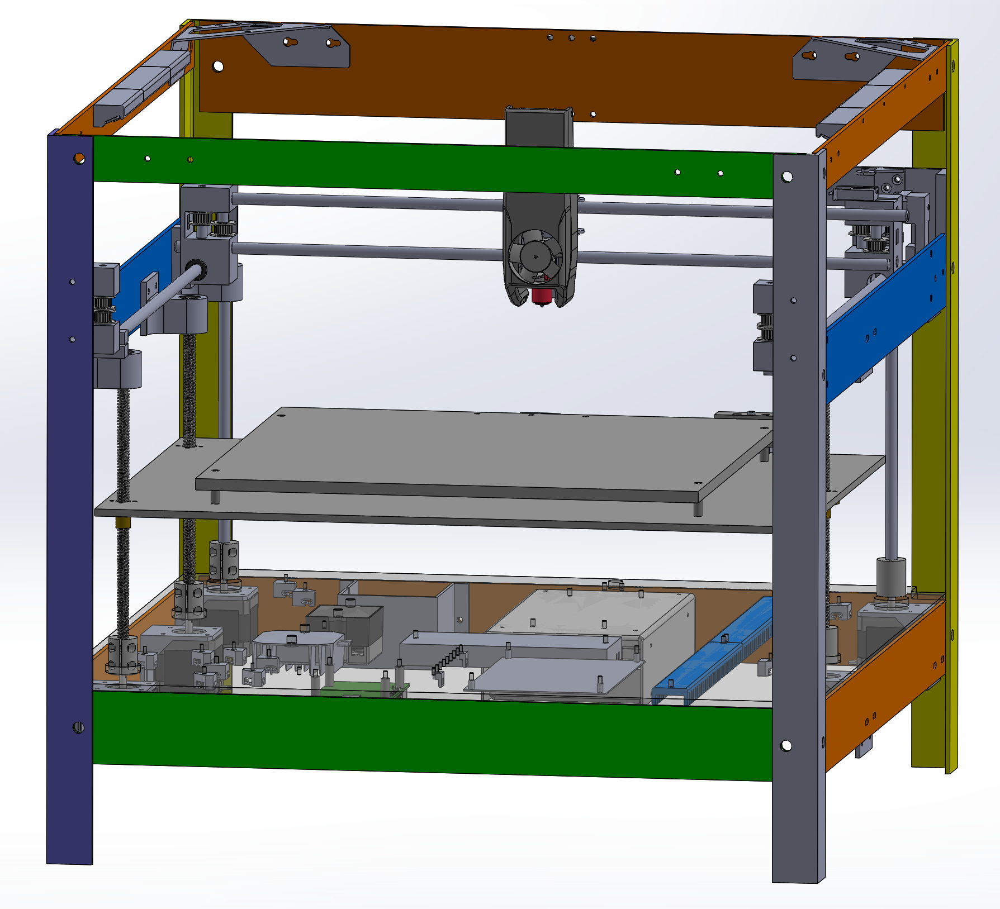

   

      
      
Latest Assembly Drawing

   

   

      
      
Latest Build Progress

   

   

      
      
Latest Electronics Assembly Drawing

   

   

      
      
Latest Electronics Build Progress

   

# My100 - A version of the100 with a metal frame.

  
## &nbsp;&nbsp;&nbsp; The **My100** is a meant to be built using common metal materials for a frame instead of the more expensive 20/20 extruded aluminum of the Voron or 3D printed frame of the100. This project is based primarily upon the great work of <A HREF="https://github.com/MSzturc/the100">the100</A>.
## &nbsp;&nbsp;&nbsp; BEWARE THIS WORK IS IN PROGRESS !! This is my second complete rebuild. The first failed quad gantry leveling so I decided to start again. You can see what I have created so far and are more than welcome to contribute.
## &nbsp;&nbsp;&nbsp; Will the My100 be faster than the100, We shall see.

  
## Table of Contents
* [**My100 3D Printer Build Advantages**](#my100-3d-printer-build-advantages)
* [**Design Strategy**](#design-strategy)
* [***Imperial/Metric and Metal Thickness***](#imperialmetric-and-metal-thickness)
* [**SolidWorks 2023 Maker Edition and Equations**](#solidworks-2023-maker-edition-and-equations)
* [**Current Build Status My100 1.0 Alpha 6**](#current-build-status-my100-10-alpha-6)
* [**Previous Build Status My100 1.0 Alpha 5**](#previous-build-status-my100-10-alpha-5)
* [**Current Build Photos**](docs/CurrentBuildPhotos.md)
* [**ChangeLog**](CHANGELOG.TXT)
* [**Bill of Materials**](docs/My100BOM.md)
* [**Gotchas of building your own 3D printer**](docs/Gotchas.md)
* [**Contributing**](#contributing)

  
## My100 3D Printer Build Advantages
&nbsp;&nbsp;&nbsp; Here are some of what I believe to be My100 improvements.
<UL>
<LI>Use cheaper 6061 "L" shaped aluminum for the frame.
<LI>Wider 350 X 350mm build plate.
<LI>Keep threaded rod for Z-Axis so bed remains at height when powered off and is a less complicated assembly than gears/belts and pulleys.
<LI>Use 5mm steel shaft instead of M5 screws to support gantry bearings, eliminating noise and possible wear.
<LI>Use 20T pulley instead of F695 bearings. These seem to be higher quality. They run smoother around the 5mm steel shaft than a M5 machine screw.
<LI>All parts to be created are fully defined in SolidWorks and have been designed with equations.
<LI>Fastening holes for an enclosure is mandatory feature. Any fumes from a 3D printer should be externally vented as they are extremely harmful.
<LI>Build plate is 350 X 350mm. The height is at 200mm as I prove in the design, but is easily changed via equations of VSLength.
<LI>End stops and some sort of probe for bed leveling will be added as if you ever used a cheap 3D printer, leveling can be a nightmare.
</UL>
  

## Design Strategy
&nbsp;&nbsp;&nbsp; the100 is a great 3D printer otherwise I would not want to attempt to create one in the first place. It is also open source, as is the Voron. An inexpensive metal frame is the first goal.

&nbsp;&nbsp;&nbsp;20/20 extruded aluminum is expensive. Using more common 6061 "L" shaped aluminum is 50% cheaper. Just printing the100 with a 265x265mm bed was going to cost as of Oct 6/2023 $823 Cdn + tax. The aluminum for the frame of the My100 was $172 Cdn, including tax, plus $362 including tax for the Gantry blocks, larger 350 X 350mm bed, rod stabilizers and belt tensioners. Overall a much cheaper option with strength benefits. Further cost savings could be obtained if you created the bed out of metal too, but I splurged on a colorful bed.

&nbsp;&nbsp;&nbsp;Surprisingly, the ability to adjust location of parts is key and the primary reason for the second rebuild. Using ready mount stepper mounts turned out to be wiser than using the CNC to put the holes into the frame itself.

### Imperial/Metric and Metal Thickness
&nbsp;&nbsp;&nbsp;Important: In Canada metal is still purchased in Imperial units. While lengths can be obtained in Metric, the thickness would still be 1/8th inches (.125in). The .125in thickness is used throughout the design, but otherwise Metric is used.
 

  
## SolidWorks 2023 Maker Edition and Equations
&nbsp;&nbsp;&nbsp; SolidWorks Maker Edition is a fantastic tool and at $10 month its well worth it. You can stop the license at any time to save you money. I found it prettyy easy to use and there are so many tutorials out there.

### Globals WorkAround
&nbsp;&nbsp;&nbsp;There is one issue I have with the SolidWorks Maker edition and that is it does not include support for global variables being read in from a file for multiple parts. This is extremely annoying as many parts share the same equations when calculating the position of corresponding holes.

&nbsp;&nbsp;&nbsp;To that end I created a Node.js tool called <A HREF="https://github.com/ztalbot2000/SWECompare">SWECompare (SolidWoreks Equation Comparison)</A> to help with the task of having multiple parts use the same equations. 
 

### Understanding the Equations
&nbsp;&nbsp;&nbsp;To change the dimensions of this 3D printer or to know how it was designed, you must understand the underlying equations.

#### Vertical alignment
&nbsp;&nbsp;&nbsp;Each component is stacked relative to the other, in the following manner.

<UL>
<LI>Electronics below the lower rail.
<LI>The length of the Z-Axis threaded rods at the end of the steppers.
<LI>The bed at the top of the Z-Axis.
<LI>The build plate on top of the bed.
<LI>The tip of the hotend on the build plate equal to the build plate on top of the bed.
<LI>The middle of the top the X-Axis rod from the hot end tip..
<LI>The middle of the Y-Axis rod from the middle of the X-Axis rod.
<LI>The middle of the X-Axis rod to the top pulley of the gantry.
</UL>

#### Left to Right Alignment.
&nbsp;&nbsp;&nbsp;It is not the build plate that dictates the width but the length of the X-Axis linear rod so it fits between the left and right gantry blocks. The bed and build plate are then centered between the steppers in this direction.

#### Front to Back Alignment
&nbsp;&nbsp;&nbsp;The front steppers for the Z-Axis are by the belt tensioners. The build plate size dictates everything else. Similiarly the Y-Axis linear rail placement traverses the length of the build plate so that the hot end tip can reach the whole area.

  
## Current Build Status My100 1.0 Alpha 6
<UL>
   <LI>CAD design is complete.
   <UL>
      <LI>I was smarter in using rods as Matt pointed out when he had seen my first designs to solve flexing issues.
      <LI>Moved to Z-Tilt instead of QGL. Trying to level a four legged chair is not ideal.
      <LI>Connection points use one 8mm screw to allow for rackig adjustments.
      <LI>Steppers are mounted with a slot for adjusting.
   </UL>
   <LI> Build is complete.
   <LI> Wiring is tested. All motors move appropriately.
   <LI> All axis home.
   <LI> Bed leveling begins. This is where my redesign hopefully fixes things in the previous release.
</UL>

  
## Previous Build Status My100 1.0 Alpha 5
&nbsp;&nbsp;&nbsp; The X,Y & Z axis all home! Quad Gantry Levelling (QGL) fails. The printed bed was too flimsy and a change to lifters was unsuccessful. The CAD drawing now uses a metal bed but it did not fix QGL.

  
## Contributing
&nbsp;&nbsp;&nbsp; Best ways to contribute
* Star it on [GitHub](https://github.com/ztalbot2000/My100) - if you use it and like it please at least star it :)
* Follow the repo on [GitHub](https://github.com/ztalbot2000/My100)
* Follow me [ztalbot2000](https://github.com/ztalbot2000)

  
## Inspiration and special thanks
Based on :
* [the100]https://github.com/MSzturc/the100
* Thanks especially to those who continue to work on the100 and those who make it better.
* And most importantly my Wife.

  
## License
See [LICENSE](LICENSE)

<!---
Link References (Not Local)
-->

[ncviewer]:https://ncviewer.com
[viewstl]:https://viewstl.com/classic/
[Clicky Installation]:https://3dpblog.com/klicky-probe-installation-voron/
[BLTouch Installation]:https://www.klipper3d.org/BLTouch.html
[Heater Pad installation]:https://www.youtube.com/watch?v=RnCW7-_G2dI
[Heater Pad installation]:https://www.youtube.com/watch?v=-fMPnBuyxy8
[Heater Pad installation]:https://www.youtube.com/watch?v=BE1rW7XyXqw
[Heater Pad installation]:https://www.youtube.com/watch?v=yhzWj-oaikk
[Hot End Wiring Guide]:https://docs.ldomotors.com/en/voron/voron2/wiring_guide_rev_c
[Understanding End Stops]:https://www.youtube.com/watch?v=Q2uBK5XzX4I
[Macros - Ellis Tuning Guide]:https://ellis3dp.com/Print-Tuning-Guide
[ztalbot2000]:https://github.com/ztalbot2000
