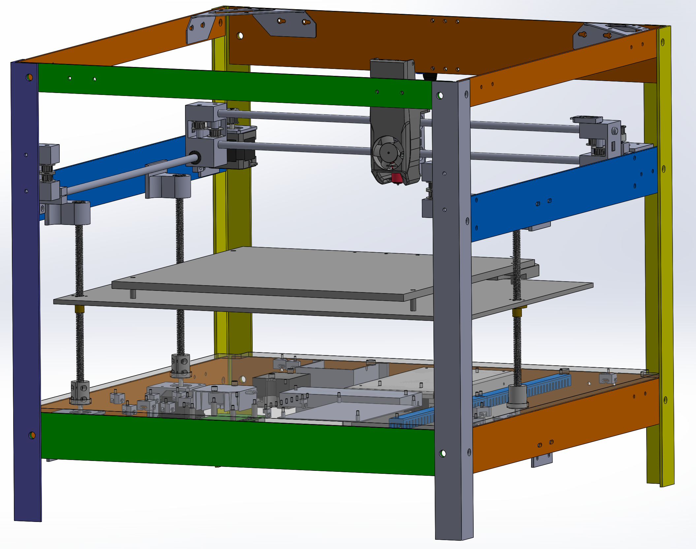

# These are a list of things I learned the hard way about building a 3D printer; So even if you do not build this printer, but decice to build your own, these are things to look out for.

## Leasons learned the hard way, that may not be so obvious.
<UL>
<LI> Many control boards with the same version number have different versions of STM32 controller chips. Understand and even try to compile the firmware for the control board you intend to buy. Take into consideration which stepper drivers you will be using as some firmware and even OS's say they support TMC2208 stepper drivers but only work with TMC2209. Prototyping just the controller with steppers and stepper drivers and getting them controlled by the OS of your choice will save you a lot of time and you may even understand the complexity of the whole project..
<LI> The more you design in SolidWorks, the less iterations you will have to build.
<LI> You need a 3D printer to build a 3D printer. Buying a cheap one is cheaper than having your parts printed. You will also learn how a 3D printer works and the pitfalls of a cheap one too.
<LI> JST-XH connectors are very tiny. Buy a good crimping tool and practice practice practice.
<LI> Buying steppers with connectors built into them will save you crimping some of the tiny JST-XH connectors.
<LI> A large 3D printer seems like the way to go, but it is correct that most things you will want to print can be done on a 235x235mm printer.
</UL>

  
## License
See [LICENSE](../LICENSE)
